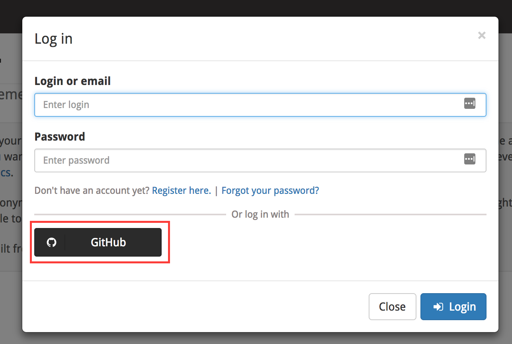
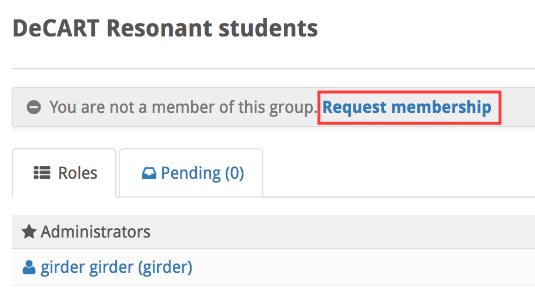
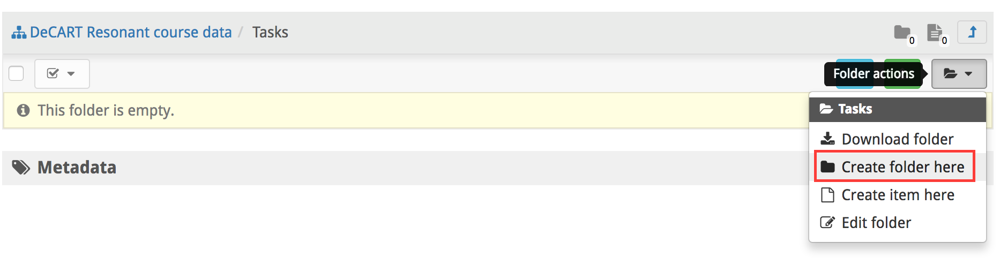
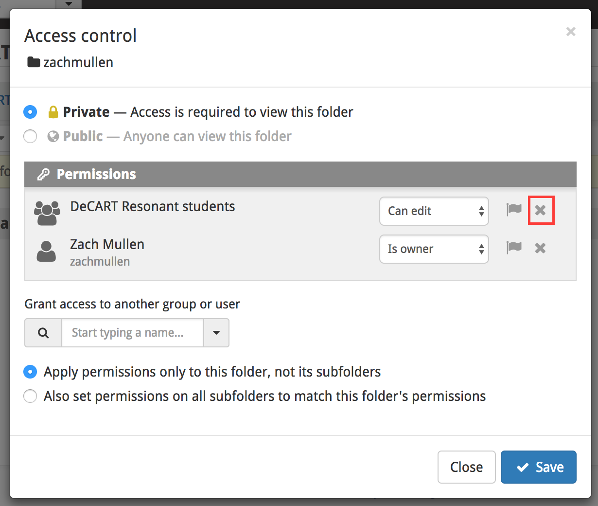

## Getting set up in Girder

1. If you do not already have a user on github, create one.
1. Log into the [DeCART Girder instance](http://34.229.214.79//) by clicking the Login link in the upper right,
   and then clicking the button to log in with Github. You must authorize the application to read your user info.
   

1. Click the **Groups** tab on the left hand side of the page, it should show a group called **Resonant course students**.
   Click that group, then click the link that says **Request membership in this group**.
   
   
1. Once I have granted you membership in the group, you should see a collection appear when you navigate to the **Collections** tab on the
   left. It should be called **DeCART Resonant course data**. If you click it, you'll see two folders: **Data** and **Tasks**.
1. Click the **Tasks** folder to navigate into it. Your group has been granted write access into this folder. Create a new folder here
   with the same name as your Girder username.
   
   
1. Navigate into the folder you just created and click the lock icon to edit the access control. By default, this new folder has inherited
   access control policies from its parent folder.
1. In the access control dialog, you should **remove** the group edit permissions for the
   students group, but **keep** the ownership permissions for your user. This folder is where you will create the tasks that will be
   represented using item metadata.
   
   
