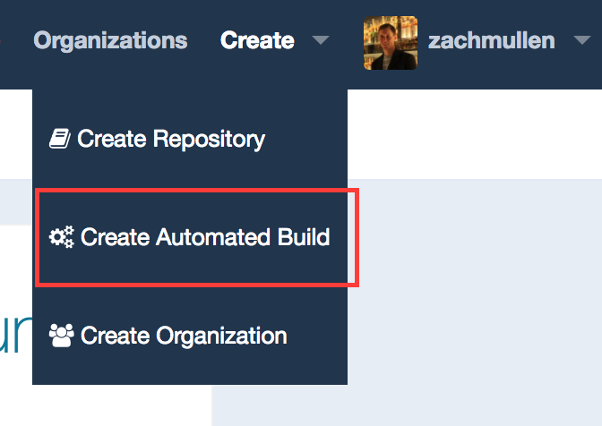
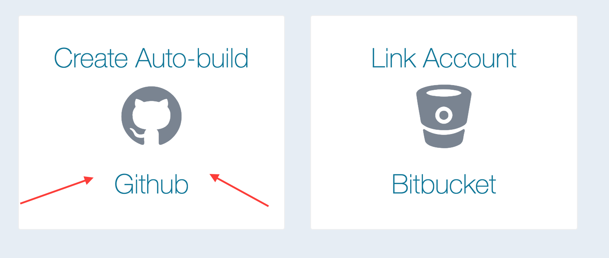
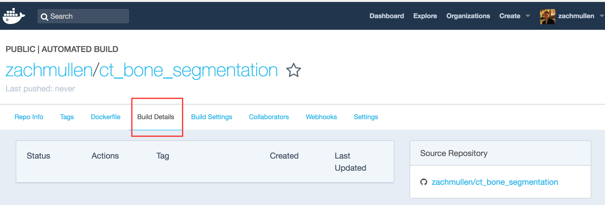

## Medical image segmentation: CLI and docker conversion

*Note: before doing this, if you are not yet familiar with docker, you should read [this blog](https://devopscube.com/what-is-docker/)
for an overview of how it works.*

For the next step, we'll take your algorithm and turn it into a command-line interface (CLI) using python's
[argparse](https://docs.python.org/3/library/argparse.html#module-argparse) module.

1. Import `argparse` into your bone segmentation script and convert the script so that it receives two required
   command-line arguments: ``--input`` for a path to the input file, and ``--output`` for a path of where
   the output file should be written. When done, you should be able to call, e.g.
   
   `bone_segmentation.py --input ./head_ct_small.nii.gz --output ./head_ct_segmented.nii.gz`
   
1. Once that CLI works, check your script into a public repository under your GitHub user.

1. Register a user on [Docker Hub](https://hub.docker.com). This is a website that will host your docker images publicly and build them
   automatically from your GitHub repositories.

1. Once registered, use the menu in the upper right to **Create automated build**. Select **GitHub** automated build, and choose the
   repository you want to auto-build.
   
   
   
   

1. Download and install [docker](https://store.docker.com/search?type=edition&offering=community) (community edition)
   onto your local machine -- this isn't strictly necessary, but it can help you test out your docker build and will let
   you run your own containers locally.

1. In your repository where you put your script, add a top level file called ``Dockerfile`` with contents like:

   ```
   # Indicate what base image we want to build on top of
   FROM python:3.4.6

   # Install the extra python libraries we'll be using
   RUN pip install nibabel scikit-image

   # Copy our algorithm script into the image
   COPY bone_seg.py /bone_seg.py

   # Make our script the executable that will be run via "docker run"
   ENTRYPOINT ["python", "/bone_seg.py"]
   ```

   Note that you should change the script name to whatever you named your python file. The lines that start with `#` are just comments,
   you can leave those out of your version if you want.
1. You can test building your container locally to make sure the build works. Run the following from the directory containing the
   `Dockerfile`:

   `docker build -t test_build .`

1. If the build succeeds locally, commit that script and push the commit. This should kick off an automated build of your docker image
   on Docker Hub, which you can monitor by navigating to it and clicking the "Builds" tab:
   
   
   
   *Note: This build may take a while (it's a free service, after all), sometimes more than 10 minutes. This may be a good time for a
   quick break.*

1. Once the build is done, you should be able to pull and run the image locally using your own docker engine. Substitute the name of
   your own image into the command below:

   ```
   $ docker run zachmullen/ct_bone_segmentation
   Unable to find image 'zachmullen/ct_bone_segmentation:latest' locally
   latest: Pulling from zachmullen/ct_bone_segmentation
   9f0706ba7422: Already exists 
   d3942a742d22: Already exists 
   c6575234aef3: Already exists 
   8af5f3519ed2: Already exists 
   27868e2bc876: Already exists 
   31a0f090796f: Already exists 
   9f4a3fe53b6e: Already exists 
   0171cdcef519: Already exists 
   e7e29b441765: Pull complete 
   6ddd62b61372: Pull complete 
   Digest: sha256:d77640e4f3dec08a03e4b7fd5387bbccc87506a491bb1f53ec0cc0952191c28f
   Status: Downloaded newer image for zachmullen/ct_bone_segmentation:latest
   usage: bone_seg [-h] --input INPUT --output OUTPUT [--threshold THRESHOLD]
                   [--closing-radius CLOSING_RADIUS]
   bone_seg: error: the following arguments are required: --input, --output
   ```
   The image was pulled because it did not yet exist locally. If you run the same command again, it will not
   perform a pull. The error we see is expected since `--input` and `--output` are required arguments to our script.
   In order to pass data from our host machine into the docker container, we'll need to
   [mount a volume](https://docs.docker.com/engine/tutorials/dockervolumes/#mount-a-host-directory-as-a-data-volume)
   when we run the container:
   
   ```
   docker run -v ~/Downloads:/data zachmullen/ct_bone_segmentation --input /data/head_ct_small.nii.gz --output /data/head_ct_segmented.nii.gz
   ```
   
   *Note: in the above example, ~/Downloads is where we assumed our head_ct_small.nii.gz file lived. If it's somewhere else on
   your host, change the command accordingly*
   
   If all goes well, the `head_ct_segmented.nii.gz` file should be written in the same directory as the input file.

1. Un-hardcode the threshold value and closing structuring element radius from your program, and make it accept those values
   as other command line arguments called `--threshold` and `--closing-radius` of type integer. Commit that change and push,
   which will trigger another automated build of your image on Docker Hub.
   
### Example solutions

[CLI script](https://github.com/zachmullen/ct_bone_segmentation/blob/master/bone_seg.py)
   
